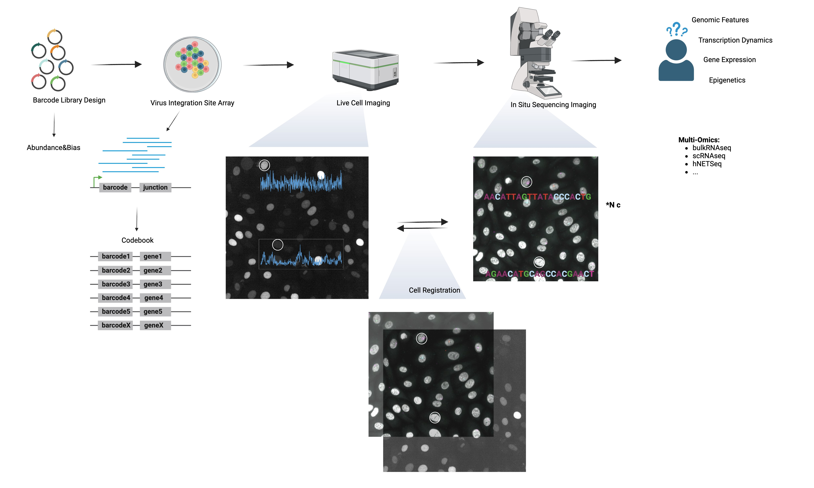

# GINK-go 

We developed an innovative technology for Genome-wide Imaging of Nascent RNA Kinetics (GINK-go). This technique merges single-molecule imaging of nascent RNA, gene barcoding, in situ sequencing, and computer vision.

There is a pipeline of how we do GINK-go analysis for each part. Parts of codes are provided.

## virus insertion site analysis

## in situ sequencing analysis
The pipeline for ISS imaging was from feldman.
(https://github.com/feldman4/OpticalPooledScreens)

## single-molecule imaging of nascent analysis

## image registration for ISS imaging and livecell imaging

## HMM fitting

## CUT&tag+ATAC-seq

