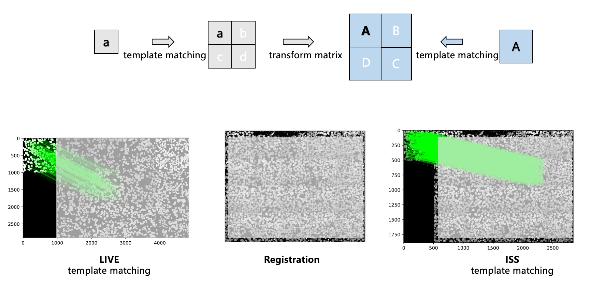
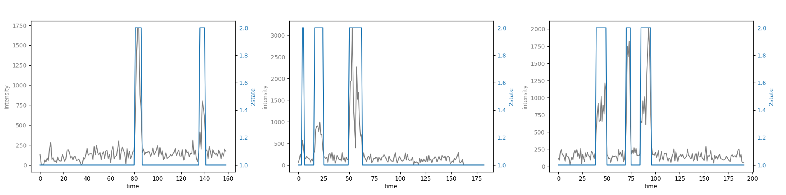

# GINK-go 

We developed an innovative technology for Genome-wide Imaging of Nascent RNA Kinetics (GINK-go). This technique merges single-molecule imaging of nascent RNA, gene barcoding, in situ sequencing, and computer vision.

There is a pipeline of how we do GINK-go analysis for each part. Parts of codes are provided.

## Virus Integration Site Analysis

The samples were initially split by Demultiplex. 

Then quality control and trimming was performed.  

The barcode-junction structure was recognized and extracted. 

Fasta-formatted file was mapped to genome by Bowtie2.

Bowtie2 mapping results were transformed into bed format by Bedtools(2.27.1) and annonated  by Gencode human annotations(v32) . 

Results were filtered  by direction and then by junction length with a cutoff of 20 bp. 

By integrating the filtered annotated results, we gained a barcode codebook.

# In Situ Sequencing Analysis

The pipeline for ISS imaging was from feldman.
(https://github.com/feldman4/OpticalPooledScreens)

## Single-molecule Imaging of Nascent RNA Analysis
An AI-driven model was designed for Single-molecule imaging of nascent RNA, which can perform cell segmentation, cell tracking and transcription site detection. 

More details can be found at (https://github.com/Zafkiel25102/Cell-tracking-and-Transcription-sites-detection)

## Image Registration for ISS Imaging and Live-cell Imaging

This part was basically done by imageJ.

“Grid/Collection stitching” tool was used for image stitching.

“Extract SIFT Correspondences” tool was used for feature extraction. 

"bUnwarpJ" tool was used for image registration and transformation matrix generation.

 registration.python was used for mapping ISS images' coordinates with live-cell images'.

## HMM Fitting

‘hmm.rscript’ was used to decode single-molecule trajectories in a two-state model.

## Epigenetics Analysis & Motif Analysis

Codes are stored in folder('/analysis')

